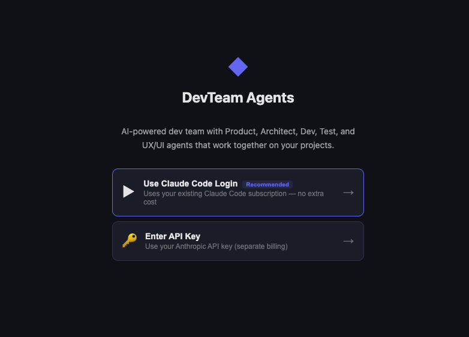
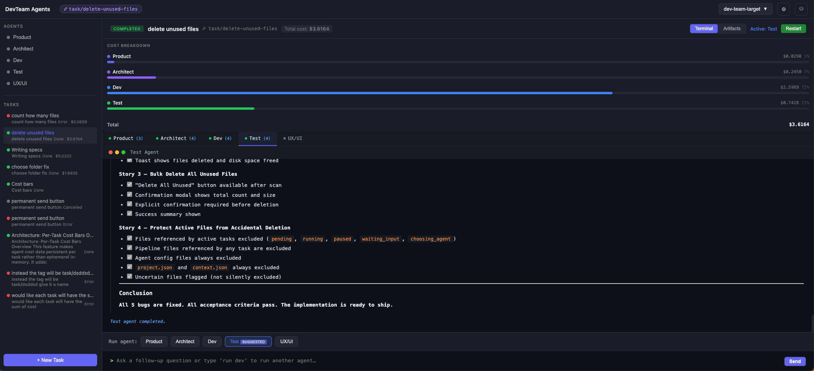
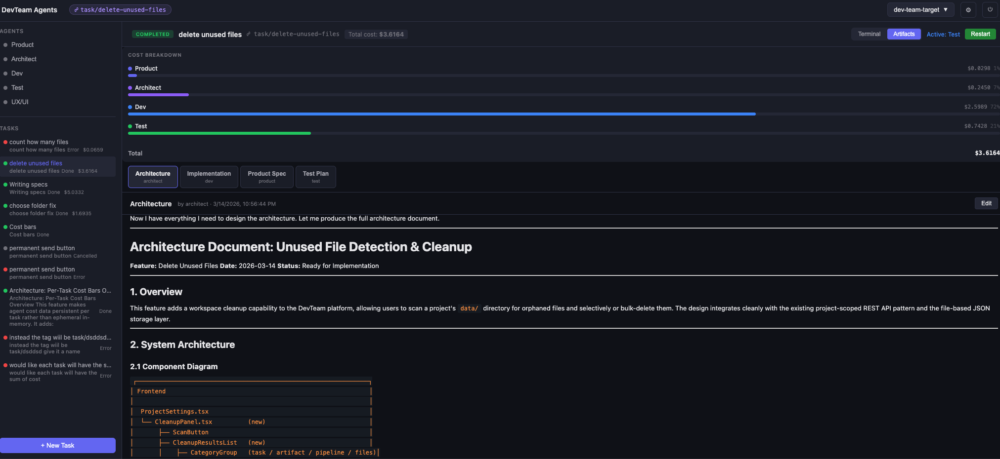
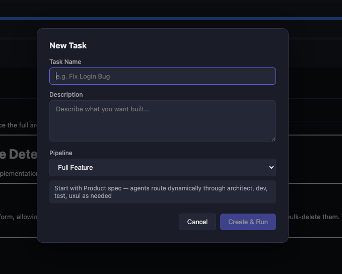

# DevTeam Agent Platform

A full-stack web platform that orchestrates AI agents (Product, Architect, Dev, Test, UX/UI) to collaboratively build software features. Each agent has specialized expertise and real access to your codebase through the Claude Agent SDK. Tasks run through configurable pipelines with human-in-the-loop controls, permission management, cost tracking, and isolated git worktrees per task.









---

## Table of Contents

- [Quick Start](#quick-start)
- [Architecture Overview](#architecture-overview)
- [Prerequisites](#prerequisites)
- [Installation](#installation)
- [Running the Project](#running-the-project)
- [Configuration](#configuration)
- [Features](#features)
  - [Projects](#projects)
  - [Tasks & Pipelines](#tasks--pipelines)
  - [AI Agents](#ai-agents)
  - [Agent Chat](#agent-chat)
  - [Permission System](#permission-system)
  - [Git Worktrees](#git-worktrees)
  - [Cost Tracking](#cost-tracking)
  - [Artifact Management](#artifact-management)
  - [Cleanup Tool](#cleanup-tool)
- [Tech Stack](#tech-stack)
- [Project Structure](#project-structure)
- [API Reference](#api-reference)
- [WebSocket Events](#websocket-events)
- [Troubleshooting](#troubleshooting)

---

## Quick Start

```bash
# 1. Clone the repo
git clone https://github.com/alonshoshani86/agents-dev-team.git
cd agents-dev-team

# 2. Install dependencies
cd backend && npm install && cd ..
cd frontend && npm install && cd ..

# 3. Authentication (choose one):
#    Option A: Set API key via environment variable
export ANTHROPIC_API_KEY="sk-ant-..."
#    Option B: Use Claude Code CLI (if installed) — configure in the UI Settings page
#    Option C: Enter API key in the UI Settings page after launch

# 4. Start backend (port 8001)
cd backend && npm run dev &

# 5. Start frontend (port 5173)
cd frontend && npm run dev &

# 6. Open http://localhost:5173
```

---

## Architecture Overview

```
Browser (React + Zustand)
   |
   |-- REST API ------------ Fastify Backend (TypeScript)
   |                              |
   +-- WebSocket ----------- Real-time events (streaming, permissions, status)
                                  |
                            Claude Agent SDK
                                  |
                            Anthropic API (Claude Sonnet / Opus)
                                  |
                            Git Worktrees (isolated branches per task)
```

The platform follows a **file-based architecture** with no database. All state is stored as JSON files in `backend/data/`. This makes the system easy to inspect, debug, and back up.

---

## Prerequisites

- **Node.js** 22.x or later
- **npm** 9.x or later
- **Git** (for worktree support)
- **Authentication** -- one of: [Claude Code CLI](https://docs.anthropic.com/en/docs/claude-code) (recommended) or an Anthropic API key
- **GitHub CLI** (`gh`) -- optional, used by the Dev agent to create pull requests

---

## Installation

### Backend

```bash
cd backend
npm install
```

### Frontend

```bash
cd frontend
npm install
```

---

## Running the Project

### Development Mode

**Backend** (auto-reloads on file changes via `tsx watch`):

```bash
cd backend
npm run dev
# Server starts on http://localhost:8001
```

**Frontend** (Vite dev server with HMR):

```bash
cd frontend
npm run dev
# Opens on http://localhost:5173
```

### Production Build

```bash
# Build frontend
cd frontend && npm run build

# Build backend
cd backend && npm run build

# Run backend (serves API)
cd backend && npm start
```

### Environment Variables

| Variable | Default | Description |
|----------|---------|-------------|
| `ANTHROPIC_API_KEY` | -- | Claude API key (can also be set via UI) |
| `PORT` | `8001` | Backend server port |
| `LOG_LEVEL` | `info` | Fastify log level (`debug`, `info`, `warn`, `error`) |

---

## Configuration

On first launch, open the app and go to **Settings** (gear icon). You have three authentication options:

### Option 1: Claude Code CLI (Recommended)
If you have [Claude Code](https://docs.anthropic.com/en/docs/claude-code) installed and authenticated, click **"Authenticate via CLI"** in the Settings page. This inherits your existing Claude Code session -- no API key needed. This is the easiest way to get started if you already use Claude Code.

### Option 2: API Key (via UI)
Enter your Anthropic API key directly in the Settings page. The key is validated before saving.

### Option 3: API Key (via Environment Variable)
Set `ANTHROPIC_API_KEY` in your shell before starting the backend. The app will pick it up automatically.

### Signing Out
Click the power icon (&#x23FB;) in the top-right corner of the app. This clears your authentication and returns you to the login screen.

### Model Selection

| Setting | Default | Purpose |
|---------|---------|---------|
| Default Model | `claude-sonnet-4-6` | Used by all agents unless overridden |
| Complex Model | `claude-opus-4-6` | Available for agents needing deeper reasoning |

Models can be overridden per-project per-agent in Project Settings.

---

## Features

### Projects

Projects are the top-level container. Each project points to one or more directories on your filesystem.

**Creating a project:**
1. Click **"New Project"** in the sidebar
2. Enter a name, description, and tech stack
3. Use the **folder picker** to select your repository path(s)
4. Click Create

**Project settings** let you:
- Edit name, description, tech stack
- Add/remove repository paths
- Customize agent system prompts per-project
- Run the cleanup tool

---

### Tasks & Pipelines

Tasks represent units of work (features, bugs, improvements). Each task runs through a **pipeline** -- a sequence of agents that collaborate.

**Creating a task:**
1. Select a project
2. Click **"New Task"**
3. Enter a title and description
4. Choose a pipeline
5. Click Create, then run the pipeline

**Built-in Pipelines:**

| Pipeline | Start Agent | Description |
|----------|------------|-------------|
| **Full Feature** | Product | Complete feature lifecycle: spec -> architecture -> code -> test |
| **Quick Fix** | Dev | Fast bug fix: implement -> test |
| **Spec Only** | Product | Requirements and architecture only, no code |
| **Dev + Test** | Dev | Implementation with QA verification |

**How pipelines work:**
1. The first agent runs and produces output
2. When done, the agent suggests which agent should go next (via `[NEXT:agent]` tags)
3. The pipeline **pauses** and shows you the suggestion
4. You choose to follow the suggestion, pick a different agent, or stop
5. The chosen agent runs with all previous artifacts as context
6. Repeat until you're satisfied

**Task statuses:**
- **Pending** -- created, not yet started
- **Running** -- an agent is actively working
- **Choosing Agent** -- pipeline paused, waiting for your next-agent choice
- **Waiting Input** -- agent needs clarification from you
- **Completed** -- task finished
- **Error** -- task failed or was interrupted by a server restart
- **Cancelled** -- task was manually cancelled

---

### AI Agents

Five specialized agents, each with distinct expertise and tool access:

#### Product Manager
- Analyzes requirements into structured specifications
- Writes user stories with acceptance criteria
- **Read-only** -- cannot modify code files
- Output: Product specs, feature requirements

#### Architect
- Designs system architecture, APIs, and data models
- Creates Architecture Decision Records (ADRs)
- Analyzes existing codebase for integration points
- Output: Architecture docs, technical specs

#### Developer
- Implements features with real file read/write access
- Works in an **isolated git worktree** (won't affect your main branch)
- Commits, pushes, and opens pull requests automatically
- Output: Working code, commits, PRs

#### Test Engineer
- Writes test plans and executes tests
- Verifies implementations match specifications
- Identifies edge cases and security issues
- Output: Test results, bug reports

#### UX/UI Designer
- Creates component specifications and wireframes
- Defines design tokens, interactions, and accessibility requirements
- Reviews existing UI for usability issues
- Output: Design specs, component guidelines

**Agent system prompts** can be customized per-project in Project Settings.

---

### Agent Chat

For one-off conversations with any agent outside of a pipeline:

1. Select an agent from the sidebar
2. Type your message
3. The agent responds with streaming text
4. Tool calls show real-time with approval prompts

Useful for quick questions, code reviews, or exploratory conversations.

---

### Permission System

Agents request permission before taking actions. This gives you full control over what changes are made.

**Tool categories:**

| Category | Tools | Default |
|----------|-------|---------|
| Read | Read, Glob, Grep, WebSearch, WebFetch | Auto-approved |
| Write | Write, Edit | Requires approval |
| Execute | Bash | Requires approval |

When an agent wants to write a file or run a command, you'll see a **permission modal** showing:
- The tool name (Write File, Edit, Run Command)
- The file path or command
- A preview of the changes

Click **Allow** or **Deny** for each action.

---

### Git Worktrees

Each task gets its own **git worktree** -- an isolated copy of your repository on a dedicated branch.

**How it works:**
- When a task starts, a worktree is created at `{repoPath}/.worktrees/{taskId}`
- A new branch `task/{task-name-slug}` is created from your default branch
- The Dev agent works exclusively in this worktree
- Changes are committed and pushed to the task branch
- The Dev agent can open PRs back to main
- Worktrees are cleaned up when tasks are deleted

**Benefits:**
- Your main branch is never touched during development
- Multiple tasks can run in parallel without conflicts
- Easy code review through standard PR workflow
- Clean git history with per-task branches

---

### Cost Tracking

Real-time cost tracking for every agent run:

- **Per-agent costs** -- see exactly how much each agent costs
- **Cumulative totals** -- task-level cost aggregation across all agents
- **Live updates** -- costs update during streaming, not just at the end
- **Visual breakdown** -- color-coded bars showing cost distribution

Costs are calculated from Claude API token usage (input, output, cache reads/writes) and displayed in USD.

The **Cost Breakdown Panel** appears in the pipeline view when cost data is available.

---

### Artifact Management

Each agent produces **artifacts** -- structured outputs that are passed to the next agent in the pipeline.

**Artifact types:**
- `spec` -- Product specifications (from Product agent)
- `architecture` -- Architecture designs (from Architect agent)
- `implementation` -- Code changes summary (from Dev agent)
- `test-plan` -- Test plans and results (from Test agent)
- `ui-review` -- Design reviews (from UX/UI agent)

**Viewing artifacts:**
- Switch to the **Artifacts** tab in the pipeline view
- Each artifact shows its type, producing agent, and full content
- Artifacts are rendered with Markdown support and syntax highlighting

Artifacts are persisted per-task and survive server restarts.

---

### Cleanup Tool

Over time, completed tasks, old artifacts, and unused pipeline configs accumulate. The cleanup tool helps manage this.

**Access:** Project Settings -> Cleanup section

**Scan categories:**

| Category | What it finds | Certainty |
|----------|--------------|-----------|
| Tasks | Completed, cancelled, or failed task directories | Safe / Uncertain |
| Artifacts | Older versions of artifacts (e.g., v1 when v2 exists) | Uncertain |
| Pipelines | Pipeline configs not used by any task | Safe |
| Files | Working files with no references | Uncertain |

**How to use:**
1. Click **Scan for unused files**
2. Review the categorized results
3. Select items to delete (or select all)
4. Confirm deletion

Scans expire after 5 minutes to prevent acting on stale data.

---

## Tech Stack

### Backend
- **Runtime:** Node.js 22.x
- **Framework:** Fastify 5.2
- **AI SDK:** @anthropic-ai/claude-agent-sdk
- **Language:** TypeScript 5.7
- **WebSocket:** @fastify/websocket
- **Storage:** File-based JSON (no database)
- **Dev tooling:** TSX (watch mode)

### Frontend
- **Framework:** React 19
- **Build:** Vite 7
- **State:** Zustand 5
- **Markdown:** react-markdown + remark-gfm
- **Syntax Highlighting:** react-syntax-highlighter
- **Language:** TypeScript 5.9

---

## Project Structure

```
agents-dev-team/
├── backend/
│   ├── src/
│   │   ├── index.ts              # Fastify server entry point
│   │   ├── storage.ts            # JSON file storage layer
│   │   ├── worktree.ts           # Git worktree management
│   │   ├── cleanup.ts            # Unused file scanner
│   │   ├── agents/
│   │   │   ├── registry.ts       # Agent config loader, runner factory
│   │   │   └── runner.ts         # Claude SDK integration (AgentRunner)
│   │   ├── orchestrator/
│   │   │   ├── engine.ts         # Pipeline execution state machine
│   │   │   ├── pipelines.ts      # Pipeline templates
│   │   │   └── models.ts         # Artifacts, history, terminals
│   │   └── routes/
│   │       ├── projects.ts       # Project CRUD
│   │       ├── tasks.ts          # Task CRUD + pipeline control
│   │       ├── agents.ts         # Agent config + chat
│   │       ├── config.ts         # API key + model settings
│   │       ├── files.ts          # Directory browser
│   │       ├── cleanup.ts        # Cleanup endpoints
│   │       └── websocket.ts      # WebSocket events
│   ├── agents/defaults/          # Agent system prompts (.md)
│   ├── data/                     # All persisted state (JSON files)
│   └── package.json
│
├── frontend/
│   ├── src/
│   │   ├── App.tsx               # Root component
│   │   ├── api/client.ts         # REST API client
│   │   ├── stores/useStore.ts    # Zustand global state
│   │   ├── types/index.ts        # TypeScript interfaces
│   │   ├── hooks/
│   │   │   └── usePipelineEvents.ts  # WebSocket pipeline listener
│   │   └── components/
│   │       ├── layout/           # TopBar, Sidebar, MainPanel
│   │       ├── pipeline/         # PipelineView, Artifacts, Costs
│   │       ├── projects/         # ProjectSettings, FolderPicker, Cleanup
│   │       └── agents/           # AgentChat, ToolApproval
│   └── package.json
│
└── README.md
```

---

## API Reference

### Projects

| Method | Endpoint | Description |
|--------|----------|-------------|
| `POST` | `/projects` | Create project |
| `GET` | `/projects` | List all projects |
| `GET` | `/projects/:id` | Get project details |
| `PUT` | `/projects/:id` | Update project |
| `DELETE` | `/projects/:id` | Delete project |
| `GET` | `/projects/:id/git-branch` | Get current git branch |

### Tasks

| Method | Endpoint | Description |
|--------|----------|-------------|
| `POST` | `/projects/:id/tasks` | Create task |
| `GET` | `/projects/:id/tasks` | List tasks |
| `GET` | `/projects/:id/tasks/:taskId` | Get task details |
| `PUT` | `/projects/:id/tasks/:taskId` | Update task |
| `DELETE` | `/projects/:id/tasks/:taskId` | Delete task + worktree |
| `POST` | `/projects/:id/tasks/:taskId/run` | Start pipeline |
| `POST` | `/projects/:id/tasks/:taskId/pause` | Pause task |
| `POST` | `/projects/:id/tasks/:taskId/resume` | Resume task |
| `POST` | `/projects/:id/tasks/:taskId/cancel` | Cancel task |
| `POST` | `/projects/:id/tasks/:taskId/next-agent` | Choose next agent |
| `POST` | `/projects/:id/tasks/:taskId/run-agent` | Run single agent |
| `POST` | `/projects/:id/tasks/:taskId/ask-agent` | Ask agent a question |
| `POST` | `/projects/:id/tasks/:taskId/permission-response` | Approve/deny tool use |
| `POST` | `/projects/:id/tasks/:taskId/inject` | Inject context |
| `GET` | `/projects/:id/tasks/:taskId/artifacts` | List artifacts |
| `GET` | `/projects/:id/tasks/:taskId/history` | Get execution history |
| `GET` | `/projects/:id/tasks/:taskId/terminals` | Get terminal logs |
| `GET` | `/projects/:id/tasks/:taskId/status` | Get current execution status |
| `GET` | `/projects/:id/tasks/:taskId/artifacts/:type/content` | Get artifact content |
| `GET` | `/projects/:id/tasks/:taskId/artifacts/:type/runs` | List artifact run history |
| `PUT` | `/projects/:id/tasks/:taskId/artifacts/:type` | Update artifact content |

### Agents

| Method | Endpoint | Description |
|--------|----------|-------------|
| `GET` | `/projects/:id/agents` | List agents |
| `GET` | `/projects/:id/agents/:name` | Get agent config |
| `PUT` | `/projects/:id/agents/:name` | Update agent config |
| `POST` | `/projects/:id/agents/:name/chat` | Stream chat with agent (WebSocket) |

### Config

| Method | Endpoint | Description |
|--------|----------|-------------|
| `GET` | `/config` | Get config (masked key) |
| `PUT` | `/config` | Update config |
| `POST` | `/config/validate-key` | Validate API key |
| `POST` | `/config/auth-cli` | CLI authentication |
| `POST` | `/config/logout` | Clear auth and sign out |

### Other

| Method | Endpoint | Description |
|--------|----------|-------------|
| `GET` | `/health` | Health check |
| `GET` | `/browse?path=...` | Directory browser |
| `GET` | `/projects/:id/cleanup/scan` | Scan unused files |
| `POST` | `/projects/:id/cleanup/delete` | Delete unused files |
| `GET` | `/projects/:id/pipelines` | List pipelines |

---

## WebSocket Events

Connect to `ws://localhost:8001/ws/projects/:projectId/events` for real-time updates.

### Pipeline Events

| Event | Description | Key Fields |
|-------|-------------|------------|
| `task_started` | Pipeline execution began | `task_id`, `pipeline` |
| `step_started` | Agent started working | `task_id`, `agent` |
| `step_chunk` | Text chunk streamed | `task_id`, `agent`, `content` |
| `step_completed` | Agent finished | `task_id`, `agent`, `next_agent` |
| `choose_next_agent` | Waiting for user choice | `task_id`, `suggested_agent` |
| `pipeline_needs_input` | Agent needs clarification | `task_id`, `agent`, `message` |
| `usage_update` | Token/cost update | `task_id`, `agent`, `costUSD`, `inputTokens`, `outputTokens` |
| `permission_request` | Tool needs approval | `task_id`, `id`, `toolName`, `toolInput`, `summary` |
| `task_completed` | Task finished successfully | `task_id` |
| `task_error` | Task failed | `task_id`, `message` |
| `task_cancelled` | Task cancelled | `task_id` |
| `task_paused` | Task paused | `task_id` |
| `task_resumed` | Task resumed | `task_id` |
| `pipeline_stopped` | Pipeline hit max iterations | `task_id` |
| `next_agent_chosen` | User chose next agent | `task_id`, `agent` |
| `permission_resolved` | Permission request resolved | `task_id`, `permission_id` |

### Ask-Agent Events

| Event | Description | Key Fields |
|-------|-------------|------------|
| `ask_agent_started` | Agent question started | `task_id`, `agent` |
| `ask_agent_chunk` | Text chunk from agent response | `task_id`, `agent`, `content` |
| `ask_agent_done` | Agent finished responding | `task_id`, `agent` |
| `ask_agent_error` | Error during agent question | `task_id`, `message` |

### Activity Events

| Event | Description | Key Fields |
|-------|-------------|------------|
| `thinking_start` | Agent started thinking | `task_id`, `agent` |
| `thinking_chunk` | Thinking content | `task_id`, `agent`, `content` |
| `tool_start` | Tool execution started | `task_id`, `agent`, `toolName` |
| `tool_end` | Tool execution finished | `task_id`, `agent`, `toolName`, `summary` |
| `tool_result` | Tool output | `task_id`, `agent`, `toolName`, `preview` |
| `agent_status` | Agent status changed | `task_id`, `agent`, `status` (`working`/`idle`) |

---

## Troubleshooting

### Backend won't start

**Port in use:**
```bash
lsof -i :8001
kill -9 <PID>
```

**Node not found (background processes):**
Use full path: `/usr/local/bin/node node_modules/.bin/tsx watch src/index.ts`

### Agent produces no output

- Check the backend terminal for errors
- Verify your API key is set (`GET /config`)
- Check the agent's system prompt isn't empty (Project Settings -> agent config)

### Task stuck in "choosing_agent" or "running"

This happens when the server restarts while a task was active. The platform automatically marks these as **error** on startup with a message explaining what happened. You can re-run an agent on the task to continue.

### Cost bar not showing

- Costs only appear after an agent completes (the final `usage_update` event)
- Check the backend terminal for `[runner] Result message cost data:` logs
- If `costUSD=0`, the SDK may not be returning cost data for your plan

### Slow typing during agent streaming

The frontend batches streaming chunks every 80ms to reduce re-renders. If it's still slow, check for excessive console logging in browser DevTools.

### Dev agent can't push or create PRs

- Ensure `git` is installed and configured with credentials
- Ensure `gh` CLI is installed and authenticated (`gh auth login`)
- Check the worktree exists: `ls {repoPath}/.worktrees/{taskId}`

### Permission modal not appearing

- Check WebSocket connection in browser DevTools (Network -> WS)
- Look for `permission_request` events in the console
- Auto-approved read operations won't show a modal

---

## License

MIT
